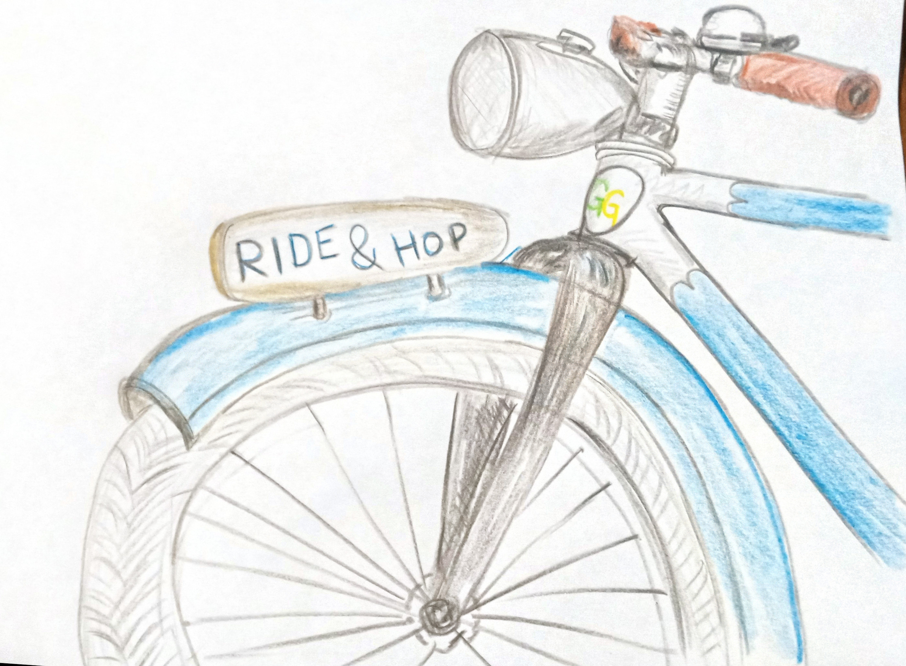

## Sonntag, 31. August 2025, 14 Uhr

## Feine Radtour mit Swingtanz Picknick

Macht euch sonntagsfein und kommt um **14 Uhr** zum [**Co-Labor** vor dem Weimarer Stadtschloss](https://www.klassik-stiftung.de/ihr-besuch/themenjahre/auf-bruch/co-labor/#c25478).

Nach einem kleinen Eröffnungstanz radeln wir enspannt entlang der Ilm zum Tiefurter Park, wo es mit Musik, Tanz und Picknick weitergeht. Picknickdecken und Proviant nicht vergessen!

Die mobile Swingschleuder begleitet uns mit feinster Tanzmusik für Lindy Hop, Charleston und Balboa.

<iframe width="425" height="350" src="https://www.openstreetmap.org/export/embed.html?bbox=11.328207850456238%2C50.97870282591961%2C11.336227655410768%2C50.981310172702415&amp;layer=cyclosm&amp;marker=50.98000651980218%2C11.332220435142517" style="border: 1px solid black"></iframe> <small><a href="https://www.openstreetmap.org/?mlat=50.980007&amp;mlon=11.332220#map=18/50.980007/11.332218&amp;layers=Y">Größere Karte anzeigen</a></small>

PS. Wir haben kein Wettrennen geplant, sondern eine Spazierfahrt. Kinder sind willkommen, im Tiefurter Park gibts viele schöne Orte zum Spielen, Verstecken und sogar an einer flachen Stelle Zugang zum Wasser.

PPS. Die Wasserstelle eignet sich auch ideal zur Kühlung heißgetanzter Füße.
